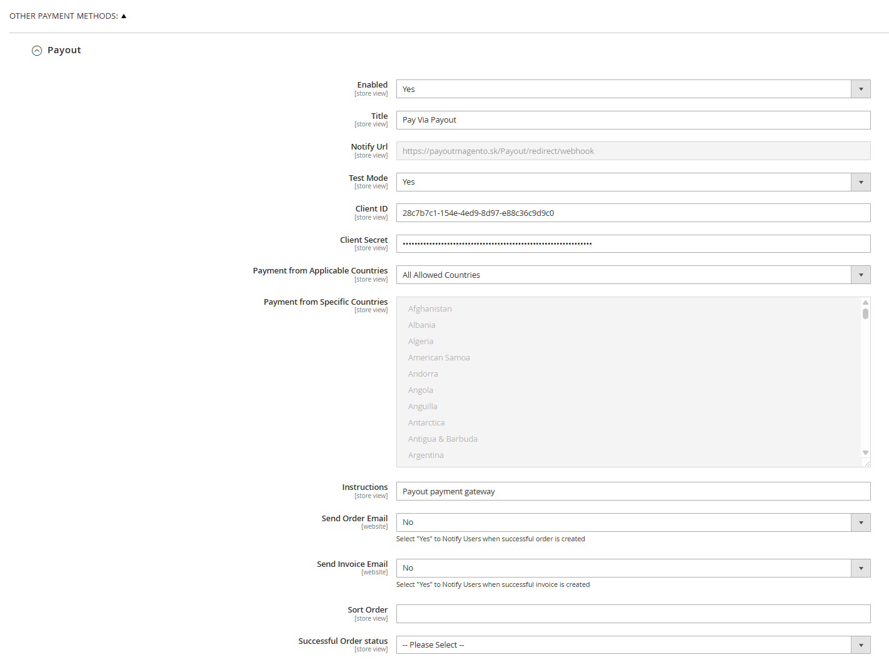
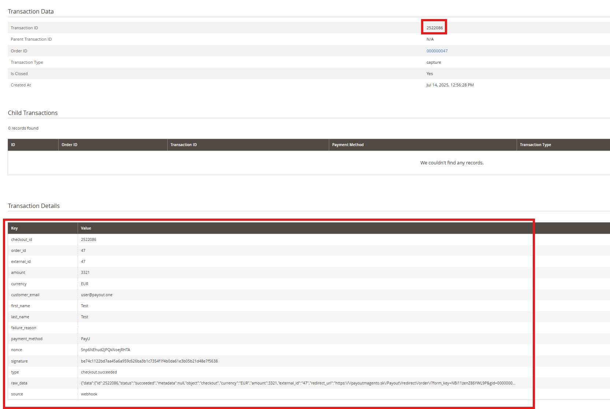

# Payout platobné rozšírenie

## Podporované magento verzie

2.4.8 a vyššie

## Podporované php verzie

php 8.3 a vyššie

## Inštalácia rozšírenia

Pre inštaláciu rozšírenia sú potrebné nasledujúce kroky:

1. Nakopírovať súbory rozšírenia do magento zložky app/code/Payout/Payment
2. Spustiť príkazy cez magento cli
   tool (https://experienceleague.adobe.com/en/docs/commerce-operations/tools/cli-reference/commerce-on-premises)
    - `bin/magento setup:upgrade`
    - `bin/magento setup:di:compile`
    - `bin/magento setup:static-content:deploy -f`
    - načítanie sk prekladov: `bin/magento setup:static-content:deploy sk_SK -f`
    - načítanie en prekladov  `bin/magento setup:static-content:deploy en_US -f`
    - pre zmazanie cache: `bin/magento cache:clean`, `bin/magento cache:flush`
    - ak je potrebná reindexácia: `bin/magento indexer:reindex`
3. Nastaviť konfigurácie rozšírenia
    - `Client id` - payout id klienta (`bin/magento config:set payment/payout/payout_id hodnota_id`)
    - `Client secret` - payout tajomstvo klienta (
      `bin/magento config:set payment/payout/encryption_key hodnota_encryption_key`)
    - `Test mode` - či má byť aktivovaný test mód - pripájanie na sandbox api(
      `bin/magento config:set payment/payout/sandbox_mode 0/1`)
    - `Notify url` - túto url treba nastaviť pri generovaní api kľúča v payout merchant rozhraní
    - `Payment from Applicable Countries` - z ktorých krajín má byť povolená platba
        - zo všetkých krajín
        - z vybratých krajín - treba zvoliť krajiny v konfigurácii `Payment from Specific Countries`
    - `Send Order Email` - či poslať mail po úspešnom dokončení objednávky (
      `bin/magento config:set payment/payout/order_email 0/1`)
    - `Send Invoice Email` - či poslať mail po úspešnom vytvorení faktúry (
      `bin/magento config:set payment/payout/invoice_email 0/1`)
    - `Successful Order status` - aký stav objednávky nastaviť po úspešnej platbe, ak nie je zvolený, default je
      processing
      

## Admin rozhranie

Po úspešnej platbe, sú údaje o platbe zaznamenané v detaile objednávky v časti `Transactions`. Po výbere danej
transakcie sa zobrazia dáta o platbe.

## Logy

Logy sa nachádzajú v súbore `var/log/payout.log`
